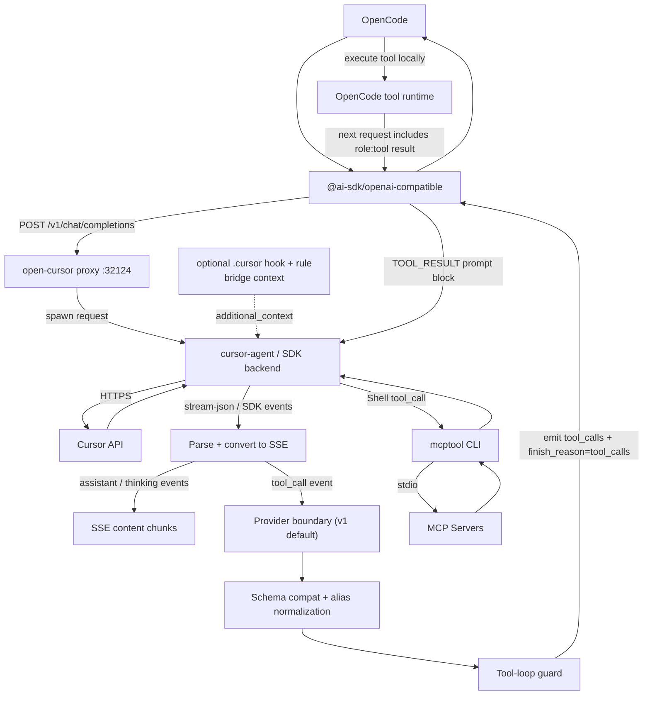

<p align="center">
  
  
  
</p>

No prompt limits. No broken streams. Full thinking + tool support in OpenCode. Your Cursor subscription, properly integrated.

## Installation

### Option A — npm global + install

```bash
npm install -g @rama_nigg/open-cursor
open-cursor install
```

`open-cursor install` writes OpenCode config. It does not touch `.cursor` by default. The runtime bridge is built into the plugin.

Optional: `open-cursor install --install-cursor-bridge` also writes `.cursor/hooks.json`, `.cursor/hooks/opencode-bridge-context.mjs`, and `.cursor/rules/opencode-bridge.mdc`. Use `--cursor-bridge-scope user` to write under `~/.cursor` instead.

Then authenticate and verify:
```bash
cursor-agent login
opencode models | grep cursor-acp
```

Upgrade: `npm update -g @rama_nigg/open-cursor`

<details>
<summary><b>Option B</b> — shell installer</summary>

**Linux & macOS:**

```bash
curl -fsSL https://raw.githubusercontent.com/Nomadcxx/opencode-cursor/main/install.sh | bash
```

The shell installer prefers the npm package. If npm is not available, it falls back to the Go TUI or a shell-only path. The default path writes OpenCode config only.

</details>

<details>
<summary><b>Option C</b> — Add to opencode.json</summary>

Add to `~/.config/opencode/opencode.json` (or `%USERPROFILE%\.config\opencode\opencode.json` on Windows):

```json
{
  "plugin": ["@rama_nigg/open-cursor@latest"],
  "provider": {
    "cursor-acp": {
      "name": "Cursor ACP",
      "npm": "@ai-sdk/openai-compatible",
      "options": {
        "baseURL": "http://127.0.0.1:32124/v1"
      },
      "models": {
        "cursor-acp/auto": { "name": "Auto" }
      }
    }
  }
}
```

Manual config does not install the optional Cursor bridge hook and rule. Run Option A with `--install-cursor-bridge` from a workspace if you want those files.

> **Refresh models anytime** with the bundled CLI:
> ```bash
> open-cursor sync-models                       # plain list
> open-cursor sync-models --variants --compact  # group thinking / fast / -low/-high variants under each base
> ```
> The `--variants --compact` form folds dozens of `*-thinking-fast`, `*-high-fast`, etc. into a single entry per family with a `variants` map, and includes `cost` from the Cursor pricing table so OpenCode TokenSpeed can render usage correctly.
</details>

<details>
<summary><b>Option D</b> — Go TUI installer</summary>

```bash
git clone https://github.com/Nomadcxx/opencode-cursor.git
cd opencode-cursor
go build -o ./installer ./cmd/installer && ./installer
```

The TUI writes OpenCode config. Use `./installer --install-cursor-bridge` only if you want the optional `.cursor` hook and rule.
</details>

<details>
<summary><b>Option E</b> — LLM paste</summary>

```
Install open-cursor for opencode: run `npm install -g @rama_nigg/open-cursor`, then run `open-cursor install` from the workspace so it writes opencode config. Auth with `cursor-agent login`. Verify with `opencode models | grep cursor-acp`. If you want the optional cursor hook/rule fallback, run `open-cursor install --install-cursor-bridge`.
```
</details>

<details>
<summary><b>Option F</b> — Development (from source)</summary>

```bash
git clone https://github.com/Nomadcxx/opencode-cursor.git
cd opencode-cursor
./scripts/install-plugin.sh
```

Verify: `opencode models | grep cursor-acp`
</details>

## Authentication

Most users:
```bash
cursor-agent login
```

Or via OpenCode:
```bash
opencode auth login --provider cursor-acp
```

<details>
<summary><b>SDK backend auth</b> (only if using <code>CURSOR_ACP_BACKEND=sdk</code> or SDK fallback)</summary>

Set a real Cursor API key from [cursor.com/settings](https://cursor.com/settings):

```bash
export CURSOR_API_KEY=<your-api-key>
```

Other supported methods (priority order): OpenCode auth store (`opencode auth login --provider cursor-acp`), or `apiKey` in the `cursor-acp` provider options in `opencode.json`.

Do not use the historical `cursor-agent` placeholder string as an SDK key.
</details>

## Usage

```bash
opencode run "your prompt" --model cursor-acp/auto
opencode run "your prompt" --model cursor-acp/sonnet-4.5
```

## MCP Tool Bridge

Any MCP servers already configured in your `opencode.json` work automatically with cursor-acp models — no extra setup needed. The plugin discovers them at startup and injects usage instructions into the system prompt so the model calls them via cursor-agent's Shell tool.

`mcptool` is a shell CLI, so opencode applies your `bash` permission rules to `mcptool call ...`. If you rely on MCP tools asking for confirmation, keep `bash` as `ask` or add explicit `ask`/`deny` rules for `mcptool call *`.

```bash
mcptool servers                                    # list discovered servers
mcptool tools [server]                             # list available tools
mcptool call hybrid-memory memory_stats            # call a tool manually
mcptool call playwright browser_navigate '{"url":"https://example.com"}'
```

Any MCP server using stdio transport works. Tested with hybrid-memory, @modelcontextprotocol/server-filesystem, @playwright/mcp, and @modelcontextprotocol/server-everything.

## Architecture



<details>
<summary><b>How the proxy works</b></summary>

The proxy uses a dual-backend runtime. In `auto` mode (default) it prefers the `cursor-agent` binary when available. If `cursor-agent` is unavailable and a real Cursor API key is configured, or if `CURSOR_ACP_BACKEND=sdk` is set, a persistent Node.js child process (`scripts/sdk-runner.mjs`) runs `@cursor/sdk` on behalf of the proxy.

By default, the SDK Agent runs in isolated mode (`settingSources: []`). To load Cursor environment settings in SDK mode, set `CURSOR_ACP_SETTING_SOURCES=all`.

Default tool-loop mode: `CURSOR_ACP_TOOL_LOOP_MODE=opencode`. Details: [docs/architecture/runtime-tool-loop.md](docs/architecture/runtime-tool-loop.md).

Startup model refresh is additive by default. Use `CURSOR_ACP_MODEL_AUTO_REFRESH=false` to disable it, or `CURSOR_ACP_MODEL_AUTO_REFRESH=compact` to fold Cursor model variants into opencode variants.
</details>

## Alternatives
Cursor integration in opencode still has tradeoffs. Pick the least bad option for your workflow.
|                   |        open-cursor         | [yet-another-opencode-cursor-auth](https://github.com/Yukaii/yet-another-opencode-cursor-auth) | [opencode-cursor-auth](https://github.com/POSO-PocketSolutions/opencode-cursor-auth) | [cursor-opencode-auth](https://github.com/R44VC0RP/cursor-opencode-auth) |
| ----------------- | :------------------------: | :--------------------------------------------------------------------------------------------: | :----------------------------------------------------------------------------------: | :----------------------------------------------------------------------: |
| **Architecture**  | HTTP proxy via cursor-agent |                                       Direct Connect-RPC                                       |                             HTTP proxy via cursor-agent                              |                       Direct Connect-RPC/protobuf                        |
| **Platform**      |   Linux, macOS, Windows    |                                      Linux, macOS                                           |                                     Linux, macOS                                     |                          macOS only (Keychain)                           |
| **Max Prompt**    |   Unlimited (HTTP body)    |                                            Unknown                                             |                                   ~128KB (ARG_MAX)                                   |                                 Unknown                                  |
| **Streaming**     |           ✓ SSE            |                                             ✓ SSE                                              |                                     Undocumented                                     |                                    ✓                                     |
| **Error Parsing** |   ✓ (quota/auth/model)     |                                               ✗                                                |                                          ✗                                           |                              Debug logging                               |
| **Installer**     |     ✓ TUI + one-liner      |                                               ✗                                                |                                          ✗                                           |                                    ✗                                     |
| **OAuth Flow**    |  ✓ OpenCode integration    |                                            ✓ Native                                            |                                    Browser login                                     |                                 Keychain                                 |
| **Tool Calling**  | ✓ OpenCode-owned loop |                                            ✓ Native                                            |                                    ✓ Experimental                                    |                                    ✗                                     |
| **MCP Bridge**    | ✓ mcptool CLI (any MCP server) |                                               ✗                                                |                                          ✗                                           |                                    ✗                                     |
| **Stability**     | Stable (uses official CLI) |                                          Experimental                                          |                                        Stable                                        |                               Experimental                               |
| **Dependencies**  |     bun, cursor-agent      |                                              npm                                               |                                  bun, cursor-agent                                   |                               Node.js 18+                                |
| **Port**          |           32124            |                                             18741                                              |                                        32123                                         |                                   4141                                   |

## Troubleshooting

- `fetch() URL is invalid` or auth errors → `cursor-agent login` or `opencode auth login --provider cursor-acp`
- `CURSOR_API_KEY not set` in SDK mode → set a real API key from [cursor.com/settings](https://cursor.com/settings), or use `CURSOR_ACP_BACKEND=auto` with a working `cursor-agent`
- Model not responding → verify your API key/quota
- Quota exceeded → [cursor.com/settings](https://cursor.com/settings)
- Proxy not starting → ensure port 32124 is available

Debug logging: `CURSOR_ACP_LOG_LEVEL=debug opencode run "your prompt" --model cursor-acp/auto`

## Roadmap


[X] **Stabilise** — Clean up dead code, fix test isolation
[X] **MCP Bridge** — Bridge MCP servers into Cursor models via `mcptool` CLI
[ ] **Simplify** — Rip out serialisation layers
[ ] **ACP + MCP** — Structured protocols end-to-end

**ACP + MCP (deferred)** — End goal is a thin `OpenCode → Cursor ACP → MCP` plugin, not an evolved proxy. We ship the bridge until Cursor's ACP path passes MCP + headless approval re-validation. [Why and when →](docs/architecture/cursor-acp-mcp-future.md)

## License

BSD-3-Clause
