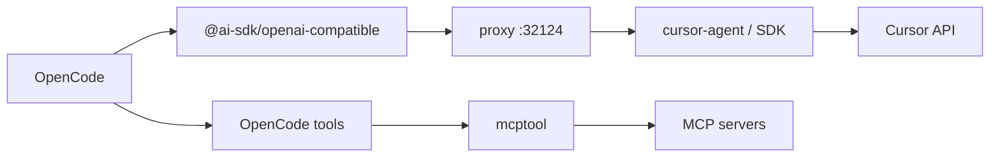
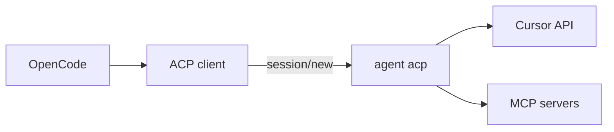

# Cursor ACP + MCP: Future Architecture

- **Status:** Deferred. ACP transports sessions; Cursor keeps tool execution.
- **Last reviewed:** 2026-07-09 (upstream desk review; no new local tests)
- **Last local test:** 2026-06-28 on cursor-agent `2026.06.26-7079533`
- **Today:** `open-cursor` bridge, see [runtime-tool-loop.md](runtime-tool-loop.md)

---

## Summary

**North star:** `OpenCode → Cursor ACP → MCP`. OpenCode as host, Cursor's ACP agent as backend, MCP passed in at session setup, minimal glue in this repo.

**Today:** We ship a **bridge** (HTTP proxy → cursor-agent or SDK → OpenCode-owned tool loop; MCP via `mcptool`). The local Cursor CLI includes ACP, and our tests show it cannot replace the bridge yet: Cursor's agent runs file edits itself instead of handing them to OpenCode.

This document is the decision gate and the test log. It is an architecture RFC, and it contains no implementation plan.

---

## Three architectures

### A. Production: `open-cursor` bridge

- HTTP proxy, no ACP. `CURSOR_ACP_BACKEND=auto` selects cursor-agent, with SDK fallback.
- OpenCode executes tools (`TOOL_LOOP_MODE=opencode`); the plugin normalizes stream-json at the boundary.
- MCP flows through `opencode.json` + `mcptool` instead of ACP `mcpServers`.

Works today. Bridge, not forever.

### B. Target: Cursor ACP + MCP

- ACP over stdio. MCP declared in `session/new`. The local entrypoint is `agent acp`.
- In current Cursor agent mode, the Cursor agent owns file read/edit tools.
- Goal: a thin plugin. Porting the proxy stack would defeat the point.

### C. Rejected: OpenCode core ACP provider

[PR #5095](https://github.com/anomalyco/opencode/pull/5095) added ACP as a backend provider in OpenCode core (`ACPClient`, `ACPLanguageModel` implementing `LanguageModelV2`, converters between the Vercel AI SDK and ACP messages, an MCP config mapper). Maintainers closed it in January 2026 citing maintenance bandwidth, and invited the same code as a plugin: "this may be better suited to be written as a plugin, if you did make one we are happy to add to ecosystem page." They rejected the location, and left the design itself unchallenged. The branch survives at [`aweis89/opencode#enable-acp`](https://github.com/aweis89/opencode/tree/enable-acp) (last commit 2026-01-17) and remains the best reference for mapping ACP session updates into a `LanguageModelV2` stream.

---

## Why ACP + MCP

| | |
|--|--|
| Standards | ACP for agent transport; MCP for tools. Both converging. |
| Cost | The bridge owns NDJSON parsing, aliases, schema compat, guards. Ongoing. |
| Fit | Cursor ships ACP for JetBrains and Zed; the path is real. |
| Ownership | The agent runs agent + MCP; OpenCode stays host UX. |

The bridge exists because OpenCode owns the local tool loop today. Keep ACP work separate from `src/proxy/*`; folding ACP into the proxy stack would keep the hardest maintenance costs and add another transport.

---

## Test log

What we tried, when, why, and what happened. Newest last.

### March 2026: MCP over ACP breaks upstream

Why: first attempt to route MCP through ACP `session/new` instead of `mcptool`.

- Cursor's ACP agent accepted `mcpServers` in `session/new` and connected to none of them, stdio or HTTP ([#153623](https://forum.cursor.com/t/acp-agent-silently-ignores-mcpservers-in-session-new/153623), reported against `2026.02.27-e7d2ef6`).
- Cursor staff confirmed a second, separate gap: the approval middleware blocks client-passed servers and offers no ACP-compatible approval ([#153823](https://forum.cursor.com/t/mcp-servers-passed-via-session-new-dont-work-in-acp-mode/153823)). `--approve-mcps` works in the interactive CLI alone; `--yolo` covers tool permissions and skips MCP approval.
- Workaround people used: pre-write `~/.cursor/projects/<slug>/mcp-approvals.json` with a reverse-engineered key format. We rejected that as a supported path.
- Zed ([#50924](https://github.com/zed-industries/zed/issues/50924)) and JetBrains users hit the same wall.

Outcome: MCP over ACP unusable. `mcptool` stayed our MCP path.

### April 2026: partial upstream fix, plus a regression

- A user on [#153623](https://forum.cursor.com/t/acp-agent-silently-ignores-mcpservers-in-session-new/153623) confirmed on April 12 that MCP connects again in ACP mode; Cursor staff acknowledged. The thread names no build number, and we have not run our own verification.
- Nobody posted a fix on [#153823](https://forum.cursor.com/t/mcp-servers-passed-via-session-new-dont-work-in-acp-mode/153823) (approval middleware). Last staff word (March 6): "known gap."
- Regression elsewhere: MCP tool calls stopped working in the interactive CLI build `2026.04.17` ([#158988](https://forum.cursor.com/t/cursor-agent-cli-mcp-tool-calls-silently-stopped-working-in-2026-04-17/158988)). The MCP surface moves in both directions between builds.

Outcome: the connection bug (C2 below) looks fixed; the approval gap (C3) stands.

### June 2026: local tool-ownership tests (agent `2026.06.26-7079533`)

Why: MCP wiring means little if Cursor executes file edits itself. We tested who owns tools over ACP.

Command surface:

- `agent acp` starts Cursor's ACP stdio server. `cursor-agent agent acp` resolves to the normal `agent` subcommand help and is the wrong entrypoint.
- ACP initialization advertises session modes, config options, model options, `loadSession`, and MCP capabilities.

Tool ownership:

- In default `agent` mode, Cursor sent structured `session/update` tool events for read/edit, then wrote the file itself. Our client received no `session/request_permission`.
- Advertising client filesystem support (`fs.readTextFile`, `fs.writeTextFile`) changed nothing. Cursor kept using its internal read/edit tools.
- In `plan` mode, Cursor left the file unchanged and produced a plan flow, including `cursor/create_plan`. It emitted nothing OpenCode could execute.

Bridge comparison, same build:

- `cursor-agent --print --output-format stream-json` also writes in the Cursor subprocess. `--sandbox enabled` failed to stop an edit. `--mode plan` stopped mutation by switching to planning behavior.
- An SDK-shaped `LOCAL OPENCODE TOOL RESULT` prompt failed to stop Composer 2.5 from emitting Cursor's own `editToolCall`.

Outcome: ACP gives a cleaner event protocol than stream-json, and Cursor still owns file mutation. Also observed upstream: `session/load` fails with "Session not found" for persistent-session hosts ([#155516](https://forum.cursor.com/t/cursor-acp-session-load-fails-with-session-id-not-found-breaking-persistent-sessions-acpx-openclaw-acp-runtime/155516)).

### July 2026: OpenCode-side desk review (no local tests)

Why: an ACP client changes transport alone; tool ownership also depends on what OpenCode will accept. We reviewed the OpenCode side of the gate.

- OpenCode core ships a full ACP **server** (`packages/opencode/src/acp/*`: agent, session, permission, tool). It ships no ACP **client**. The target architecture needs the client half.
- [PR #25085](https://github.com/anomalyco/opencode/pull/25085) (open since April 30) adds a Cursor Cloud provider to core and **disables local tools** for those sessions because Cursor runs tools in its own VM. It targets the Background Agents API, and its tool model matches architecture B: an OpenCode session where the backend owns execution. No maintainer review yet.
- On [#2072](https://github.com/anomalyco/opencode/issues/2072), OpenCode collaborator rekram1-node wrote on May 3: "Let me see what I can do for yall... update to follow." Nothing visible followed. Our June 28 comment summarizing the blockers is the latest substantive reply.

Outcome: two open questions moved onto the OpenCode side of the matrix (O2, O3 below).

---

## Blockers

Tool ownership resolves through exactly one of two doors: Cursor routes file operations through the ACP client (C1), or OpenCode accepts sessions where the backend owns execution (O2 + O3). An ACP client library opens neither.

### Cursor-side

| ID | Blocker | Status 2026-07-09 | Evidence |
|----|---------|-------------------|----------|
| C1 | Agent mode writes files itself; ignores client `fs` capabilities; sends no `session/request_permission` | Confirmed on `2026.06.26`; untested on newer builds | June 2026 test log |
| C2 | `mcpServers` in `session/new` ignored | Fix reported April 12; unverified by us | [#153623](https://forum.cursor.com/t/acp-agent-silently-ignores-mcpservers-in-session-new/153623) |
| C3 | Approval middleware blocks client-passed MCP servers headless; no ACP approval flow | No fix posted since March 6 | [#153823](https://forum.cursor.com/t/mcp-servers-passed-via-session-new-dont-work-in-acp-mode/153823) |
| C4 | Headless auth over ACP for non-interactive OpenCode | Untested | |

### OpenCode-side

| ID | Blocker | Status 2026-07-09 | Evidence |
|----|---------|-------------------|----------|
| O1 | Core will host no ACP provider | Confirmed; maintainers cited bandwidth and invited a plugin | [#5095](https://github.com/anomalyco/opencode/pull/5095) |
| O2 | Unknown whether a custom npm AI SDK provider package can host the ACP client (no HTTP proxy) | Untested | `enable-acp` branch as reference |
| O3 | Unknown whether OpenCode UX accepts agent-owned tools (no OpenCode permissions, no OpenCode edit loop) | Open question; core PR precedent exists | [#25085](https://github.com/anomalyco/opencode/pull/25085) |

### Design impact, short of blocking

- `loadSession` advertised and broken ([#155516](https://forum.cursor.com/t/cursor-acp-session-load-fails-with-session-id-not-found-breaking-persistent-sessions-acpx-openclaw-acp-runtime/155516)).
- MCP behavior regresses between builds ([#158988](https://forum.cursor.com/t/cursor-agent-cli-mcp-tool-calls-silently-stopped-working-in-2026-04-17/158988)); any green result needs a build number attached.

### Non-blockers

- `mcptool` ships MCP today.
- Cursor keeps investing in ACP (JetBrains, Zed).

---

## Parity: bridge vs ACP

Assumes working `session/new` + MCP without approval hacks.

| | Bridge today | ACP target |
|--|--------------|------------|
| Host | OpenCode TUI | OpenCode TUI |
| Models / auth | Proxy + cursor-agent/SDK | ACP agent |
| Streaming / thinking | SSE via proxy | ACP session updates |
| bash/edit/write | OpenCode tool loop, with Cursor-native side effects possible | Cursor agent by default |
| `permission` in opencode.json | Yes (tools + `mcptool` bash) | No equivalent; ACP agent mode edited a file without requesting permission |
| MCP from `opencode.json` | Plugin + `mcptool` | `mcpServers` in `session/new` |
| Headless MCP approval | Bash permissions | Approval middleware, or the file hack we reject ([#153823](https://forum.cursor.com/t/mcp-servers-passed-via-session-new-dont-work-in-acp-mode/153823)) |
| Custom code | Large (proxy, boundary, mcptool) | Small client + mapper |
| OpenCode core | Plugin only | Plugin only (#5095 closed) |

Fixed MCP in ACP does not equal parity. Tool ownership and permissions still differ.

---

## Decision gate

**Now:** `deferred`. ACP works as a transport and drops OpenCode-owned edit execution.

**Re-verify on each agent bump** (attach the build number to every result):

1. `agent acp` + minimal stdio MCP: does the server spawn and `tools/list` respond? (C2)
2. A real `opencode.json` server: callable without pre-written approval files? (C3)
3. File edit prompt in ACP agent mode: does Cursor request permission or call client `fs` before mutating? (C1)
4. File edit prompt in ACP plan mode: anything executable, or a plan artifact alone?
5. Update **Last reviewed**, **Last local test**, and the agent version at the top.

**Re-verify on the OpenCode side** (once, then on major OpenCode releases):

6. Can `opencode.json` load a custom npm AI SDK provider package, rather than `@ai-sdk/openai-compatible` alone? A stub provider answers this. (O2)
7. Read `enable-acp` converters: how did #5095 surface agent-owned tool events in the TUI, and does that UX hold up? (O3)
8. Watch [#25085](https://github.com/anomalyco/opencode/pull/25085) and rekram1-node's promised update on [#2072](https://github.com/anomalyco/opencode/issues/2072).

**Prototype when:** a spike can test MCP and tool ownership together without touching the proxy stack, and either C1 flips or O2 + O3 both pass.

**Migrate when:** the parity table holds for real users, with a clear bridge deprecation, accepting tool/permission model changes if needed.

**Don't:** rewrite `src/proxy/*` in place; stack ACP on the proxy; treat the gate as permanently closed.

---

## If the gate opens

1. Spike outside the proxy: ACP client alone, no `tool-loop.ts` reuse. Start from the `enable-acp` converters.
2. Map `opencode.json` MCP → ACP `mcpServers` (one-way).
3. Parity pass; document regressions.
4. Ship as a plugin, per OpenCode maintainer guidance.
5. Deprecate the bridge after sign-off, and only then.

---

## While deferred

Ship the bridge: install via README, dual backend, OpenCode tool loop, MCP via `mcptool`. The roadmap phase **ACP + MCP** stays unchecked. Deferral, not cancellation.

See [runtime-tool-loop.md](runtime-tool-loop.md).

---

## References

| | |
|--|--|
| MCP in `session/new` | [#153623](https://forum.cursor.com/t/acp-agent-silently-ignores-mcpservers-in-session-new/153623) |
| MCP approval middleware | [#153823](https://forum.cursor.com/t/mcp-servers-passed-via-session-new-dont-work-in-acp-mode/153823) |
| Interactive CLI MCP regression | [#158988](https://forum.cursor.com/t/cursor-agent-cli-mcp-tool-calls-silently-stopped-working-in-2026-04-17/158988) |
| ACP `session/load` broken | [#155516](https://forum.cursor.com/t/cursor-acp-session-load-fails-with-session-id-not-found-breaking-persistent-sessions-acpx-openclaw-acp-runtime/155516) |
| OpenCode Cursor request | [#2072](https://github.com/anomalyco/opencode/issues/2072) |
| OpenCode ACP provider PR | [#5095](https://github.com/anomalyco/opencode/pull/5095), closed; branch: [`aweis89/opencode#enable-acp`](https://github.com/aweis89/opencode/tree/enable-acp) |
| Cursor Cloud provider PR | [#25085](https://github.com/anomalyco/opencode/pull/25085), open |
| Zed MCP-over-ACP report | [zed#50924](https://github.com/zed-industries/zed/issues/50924) |

Set **Status** to `prototype-worthy` when the gate conditions pass; open a separate plan instead of growing this doc.
